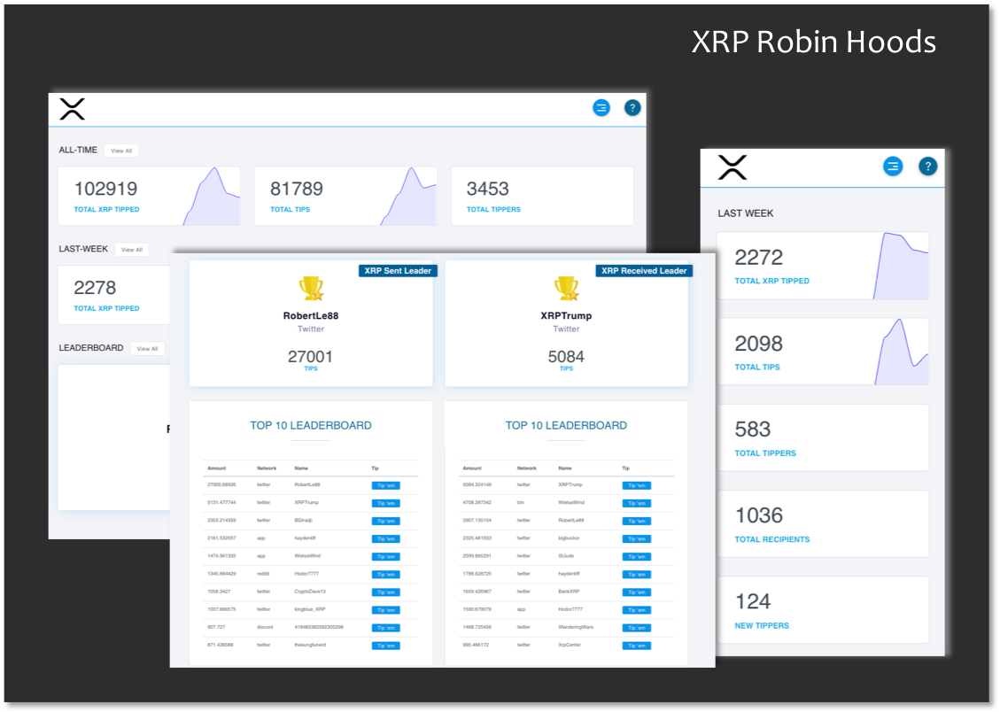

# XRP Robin Hood

## A Brief Overview

XRP Robin Hood is a dashboard app which brings transaction data from the XRP Tip Bot to life. Through simple visuals, users can explore see XRP Tip Bots continual growth, and explore the tool's Top Tippers and Tip Reciepients.

The app currently consists of four(4) main pages:

1. **Home/Dashboard:** gives users a quick glance at some all-time and last week stats.
1. **All-Time:** provides data and visuals on the all-time usage of the XRP Tip Bot and The All-Time Leaders in Tips Sent and Tips Received.
1. **Last Week:** much like the all-time page, the last week page provides data on the previous week's usage and leaders.
1. **Leaderboard:** My favorite page, and the inspiration for this app. The leaderboard outlines All-Time Leaders and Last Week's Leader in 4 different categories.
    1. Tips Sent
    1. Tips Received
    1. XRP Sent
    1. XRP Received

[See the dashboard in action.](https://xrp-robin-hood.herokuapp.com/)

## Current Features

- Visuals for Tips, XRP, Tippers, Recipients, New Tippers, & New Recipients.
- Ability to view all-time data and previous week data.
- A leaderboard to view the XRP Tip Bots most frequent users.
- Responsive, accessible interface.
- Cross Platform

## Built With

### Server Side

- **Request** - used to scrap the xrptipbot feed and populate the database.
- **MongoDB** - used to store all tip bot transactions
- **Moongoose** - used to model transaction data

### Client Side

- **React** - for the frontend
- **Redux** - for state management
- **React Sparklines** - used to generate card charts
- **React Portals** - used to create modals

## Future Features

- Ability to tip users straight from the leaderboard.
- List of newest users
- Better loading experience and optimized response times
- Ability to search users and their stats
- Filterable frontend

## Related

- [XRP Tip Bot](https://github.com/WietseWind/xrptipbot) by [Wieste Wind](https://github.com/WietseWind)

## About the project

This is my first ever application and was built over the course of a few days. I say that because I'm constantly looking to improve upon its performance and experience, so please do not hesitate to contact me with any suggests, improvements, and/or questions!

Cheers!